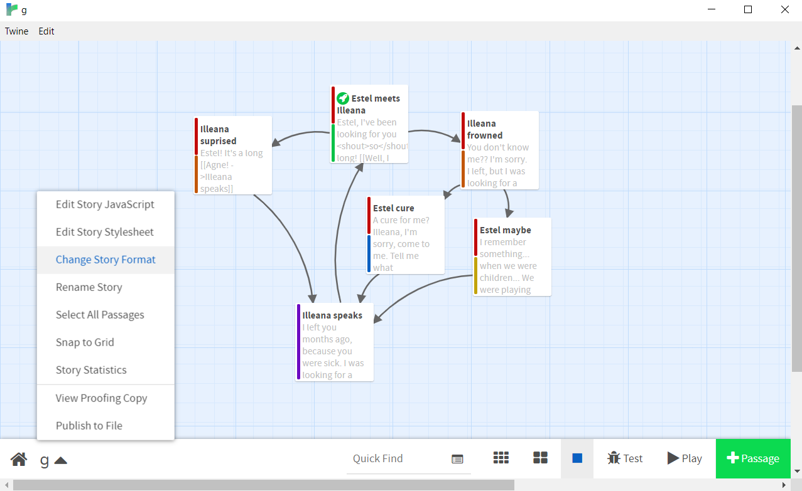

Logo made with [DesignEvo](https://www.designevo.com/)

# DEFORK

Defork is a parser for JSON format file exported from [Twine](twinery.org) - an open-source tool by Chris Klimas (using Twinson format). 

Defork is allowing to easily and conveniently create different, interactive, intriguing, branched, nonlinear conversations using Twine.

For displaying text parsed using Defork you can use for example RichText, Defold Printer or your custom code.

## RichText
The example in this repo utilizes [RichText](github.com/britzl/defold-richtext) by Bjorn Ritzl for a convenient and easy way of representing a dialogue window. In order to use RichText templates and conveniently represent conversations with options and links in GUI you have to fetch [RichText library](https://github.com/britzl/defold-richtext/archive/master.zip). Then you can easily modify settings and create a totally personalized text with all the RichText tags and even add your own custom tags functions.

## Defold Printer
Defork is just parsing a text for you form a JSON file, so you can display it however you like it. The alternative to RichText is [Defold_Printer](https://github.com/Insality/defold-printer) by Maxim Tuprikov (Insality). [The example of using it with Defork is here.](https://forum.defold.com/t/need-example-to-use-defork-with-printer-module-solved/64031)


## Installation
You can use Defork in your own project by adding this project as a [Defold library dependency](http://www.defold.com/manuals/libraries/). Open your game.project file and in the dependencies field under project add:

	https://github.com/paweljarosz/defork/archive/master.zip

Once added, you must require the main Lua module in scripts via

```
local defork = require("defork.defork")
```

Then you need to add dialogs exported from Twine in a JSON format (using Twinson - details below) to your project. To add it, you need to provide a path in [Custom Resource] field of your game.project in Defold. For example, if you have your file in the assets folder in the project directory, type: assets/dialogue.json. You can find more informations about [custom resources in official Defold's documentation here.](https://defold.com/manuals/resource/)


## What you can do?

With Defork you can easily:

- load json data exported from conversation making tool, such as Twine
- get text, options and links leading to next dialog's nodes
- store and manage current links, options and flow through nodes
- use RichText to easily show dialogue window, modify text effects
- modify data by adding actors, colors and custom text effects
- add images, portraits or emoticons to Rich Text
- manage input and handle transitions between nodes

## Twine

You can create dialogue data in Twine - an open-source tool, that combined with [Twinson](https://github.com/lazerwalker/twison) allows you to export data to a json file. This specific Twinson format is required for a proper working of Defork. Remember to Change Story Format to Twinson in order to have a json data generated after clicking Play in Twine.




## DEFORK API

### defork.load(resource)
Loads a Custom Resource with a JSON dialogue data. This function saves this data inside Defork module for convenience and optimization, so there is no need to provide dialogue (aka conversation) data for every function, that takes it as a parameter.
One must provide a proper Twinson format data to assure Defork will parse it correctly.

**PARAMETERS**
* `resource` (string) - an address of a custom resource containing Twinson format dialogue data.

**RETURNS**
* `dialogue_data` (table) - a loaded table with dialogue_data.

**EXAMPLE**
* `local dialogue = defork.load("/assets/dialogue.json")`

### defork.getName(conversation)
Returns the name of the conversation.

**PARAMETERS**
* `conversation` (table - optional) - a conversation data table. If not provided, Defork will try to use loaded and saved data.

**RETURNS**
* `name` (string) - a name of the conversation.

**EXAMPLE**
* `print("Name:", defork.getName())`
* `local name = defork.getName(other_dialogue)`

### defork.getStartNodeID(conversation)
Returns the ID of the starting node of the conversation.

**PARAMETERS**
* `conversation` (table - optional) - a conversation data table. If not provided, Defork will try to use loaded and saved data.

**RETURNS**
* `nodeID` (number) - an id of the first node of the conversation.

**EXAMPLE**
* `print("Start node ID:", defork.getStartNodeID())`
* `local start = defork.getStartNodeID()`

### defork.getCurrentNodeID(conversation)
Returns the ID of the current, saved node of the conversation

**PARAMETERS**
* `conversation` (table - optional) - a conversation data table. If not provided, Defork will try to use loaded and saved data.

**RETURNS**
* `nodeID` (number) - an id of the current node of the conversation.

**EXAMPLE**
* `print("Current Node ID:", defork.getCurrentNodeID())`
* `local current = defork.getCurrentNodeID()`

### defork.setCurrentNodeID(nodeID)
Sets and saves current dialogue node ID in the Defork module. Used for convenience and optimization, so one don't have to provide node ID, everytime it will be needed.

**PARAMETERS**
* `nodeID` (number) - a dialogue node ID. If not provided, Defork will return `nil` from this function.

**EXAMPLE**
* `defork.setCurrentNode(defork.getStartNodeID())`
* `defork.setCurrentNode(1)`

### defork.getText(nodeID, conversation)
Returns the text of the provided or saved dialogue node of the provided or saved conversation. Since Twine stores conversation text with options, this function splits it and returns only the text.

**PARAMETERS**
* `nodeID` (number - optional) - a dialogue node ID. If not provided, Defork will try to use loaded and saved data.
* `conversation` (table - optional) - a conversation data table. If not provided, Defork will try to use loaded and saved data.

**RETURNS**
* `text` (string) - a text, a speech of the selected dialogue node of the selected conversation.

**EXAMPLE**
* `print("Text of a current node:", defork.getText())`
* `local start_text = defork.getText(defork.getStartNodeID())`

### defork.getTags(nodeID, conversation)
Returns tags of the provided or saved dialogue node of the provided or saved conversation. Tags can be used to give additional information such as actor, speaker, color of the speaker, portrait/image/emoticon file, some flags to be set, etc.

**PARAMETERS**
* `nodeID` (number - optional) - a dialogue node ID. If not provided, Defork will try to use loaded and saved data.
* `conversation` (table - optional) - a conversation data table. If not provided, Defork will try to use loaded and saved data.

**RETURNS**
* `tags` (table) - a table containing tags of the current dialogue node of the current conversation.

**EXAMPLE**
* `print("Tags of a current node:", defork.getTags())`
* `local start_tags = defork.getTags(defork.getStartNodeID())`

### defork.getOptions(nodeID, conversation)
Returns options of the provided or saved dialogue node of the provided or saved conversation. Options can be used as hyperlinks to next dialogue nodes. 

**PARAMETERS**
* `nodeID` (number - optional) - a dialogue node ID. If not provided, Defork will try to use loaded and saved data.
* `conversation` (table - optional) - a conversation data table. If not provided, Defork will try to use loaded and saved data.

**RETURNS**
* `options` (table) - a table containing options of the current dialogue node of the current conversation. This table includes tables for each option, and each table contains strings: `link` - a short name of this link, `name` - a text to display for this option and number: `pid` that shows the next node ID to show, connected to this option.

**EXAMPLE**
* `	for i,_ in ipairs(defork.getOptions()) do
		print("Option "..i..":", defork.getOptionText(i))	-- every option contains text and id that links option to the next node
		print("Leads to:", defork.getOptionLink(i))
	end`
    
### defork.getOptionText(no, nodeID, conversation)
Returns one option's text (string) of the selected option of the provided or saved dialogue node of the provided or saved conversation.

**PARAMETERS**
* `no` (string) - a number of the option link. If not provided, Defork will try to use loaded and saved data.
* `nodeID` (number - optional) - a dialogue node ID. If not provided, Defork will try to use loaded and saved data.
* `conversation` (table - optional) - a conversation data table. If not provided, Defork will try to use loaded and saved data.

**RETURNS**
* `option_text` (string) - a text associated to the choosen option

**EXAMPLE**
* `	for i,_ in ipairs(defork.getOptions()) do
		print("Option "..i..":", defork.getOptionText(i))	-- every option contains text and id that links option to the next node
		print("Leads to:", defork.getOptionLink(i))
	end`

### defork.getOptionLink(no, nodeID, conversation)
Returns one option link of the selected option of the provided or saved dialogue node of the provided or saved conversation. The link points the ID of the next dialog's node that is connected with this option.

**PARAMETERS**
* `no` (string) - a number of the option link. If not provided, Defork will try to use loaded and saved data.
* `nodeID` (number - optional) - a dialogue node ID. If not provided, Defork will try to use loaded and saved data.
* `conversation` (table - optional) - a conversation data table. If not provided, Defork will try to use loaded and saved data.

**RETURNS**
* `option_link` (number) - a next dialogue node id, a node pointed by the selected option of the selected dialogue node of the selected conversation.

**EXAMPLE**
* `	for i,_ in ipairs(defork.getOptions()) do
		print("Option "..i..":", defork.getOptionText(i))	-- every option contains text and id that links option to the next node
		print("Leads to:", defork.getOptionLink(i))
	end`


## RichText helping functions (wrappers)


### defork.setRichtextSettings(new_settings)
Sets and saves current settings for RichText purposes. Used for convenience, so you don't have to provide settings everytime it will be needed. Defork actually stores default settings, so you even don't need to worry if something is missed.

**PARAMETERS**
* `new_settings` (table - optional) - new RichText settings table. If any of the fields is not filled, Defork will use its own default settings. For settings format see RichText documentation.

**EXAMPLE**
* ` local new_settings = {}
    new_settings.width = 250
	defork.setRichtextSettings(new_settings)`

### defork.setRichtextParent(guiNodeID)
Sets and saves a special setting for RichText purposes - a parent gui node. Used for convenience, so you don't have to provide parent everytime it will be needed and easily change parent. Defork doesn't stores any default parent, so you have to create a gui with a node, that will be a parent to RichText words.

**PARAMETERS**
* `guiNodeID` (gui_node_id) - new RichText parent gui node id. If not provided, Defork will try to use loaded and saved data, and if it is not existing it will return `false`.

**EXAMPLE**
* ` self.node = gui.get_node("box")
	defork.setRichtextParent(self.node)`

### defork.setRichtextFont(font)
Sets and saves a special setting for RichText purposes - a font. Used for convenience, so you don't have to provide font everytime it will be needed and easily change it. Defork doesn't stores any default font, so you have to create a gui with a font, that will be used in RichText words.

**PARAMETERS**
* `font` (string) - new RichText gui font. If not provided, Defork will try to use loaded and saved data, and if it is not existing it will return `false`.

**EXAMPLE**
* ` defork.setRichtextFont("system_font")`

### defork.createOnePanelText(text, options, speaker, speaker_color, speaker_image)
Creates and modifies a text to display in RichText GUI. A template to show what can be done with RichText and Defork.

**PARAMETERS**
* `text` (string) - a text, a speech to display
* `options` (table - optional) - a table containg option links, the function will make them a clickable RichText hyperlinks.
* `speaker` (string - optional) - a speaker's name, a tag that tells who is speaking the speech.
* `speaker_color` (string - optional) - a tag that tells on what color the speaker's name should be painted.
* `speaker_image` (string - optional) - a path to a gui texture, an image representing e.g. speaker's portrait or emotion.

**RETURNS**
* `text` (string) - a modified text that can be shown using RichText

**EXAMPLE**
* ` self.text = defork.createOnePanelText(self.text, defork.getOptions(1), "Estel", "orange", self.image)`

### defork.showRichText(text, guiNodeID, font, custom_check_tags_function)
Creates a RichText words under the specified parent node and check tags with a specified or default check function. To see how custom check functions can be made to implement different tags see Defork example or RichText documentation. For best results, modify the loaded text with RichText tags etc. or with a template function.

**PARAMETERS**
* `text` (string) - a text, a speech to display
* `guiNodeID` (gui_node_id - optional) - a table containg option links.
* `font` (string - optional) - a RichText gui font. If not provided, Defork will try to use loaded and saved data.
* `custom_check_tags_function` (function - optional) - a custom function for checking custom tags in RichText. You can for example modify and animate words nodes properties.

**RETURNS**
* `words` (RichText data table) - a words nodes created by RichText. You can check for inputs on those words, for example on clickable options.

**EXAMPLE**
* ` self.words = defork.showRichtext(self.text)`


### defork.refreshGUI(gui_node_id_to_refresh)
Clones the provided GUI node, delete old one and returns ID of the new node. Used to refresh GUI, on which the RichText was displayed, so you can display another text again. It sets the new node as the default parent for RichText, so you don't have to attach it again, if you don't need to.

**PARAMETERS**
* `gui_node_id_to_refresh` (gui_node_id)- a GUI node ID that you want to refresh, so it means: clone it, remove old one and return new.

**RETURNS**
* `next_node` (gui_node_id) - a GUI node ID of the new, cloned node, that is already saved as a default parent for RichText.

**EXAMPLE**
* ` self.node = defork.refreshGUI(self.node)`

### defork.on_input(richtextWords, action)
Additional function used to acquire inputs in gui_script's on_input() function, to easily handle RichText hyperlinks. RichText then sends a message to that gui_script, so you can handle input over different hyperlinks. See Defork example or RichText documentation for more information about messages.

**PARAMETERS**
* `richtextWords` (RichText data table) - a words table returned by richtext.create(..) function needed for richtext.on_click(..), which gets input over hyperlinks.
* `action` - on_input() function's parameter used to check if it was action.pressed.

**EXAMPLE**
* ` defork.on_input(self.words, action)`


## Debugging

Defork module has a `defork.debug` flag set to true by default. When it is set to true, all info and warnings will be printed to console, otherwise - only errors.

## Notice

DEFORK - is an asset that allows Defold users to easily create interactive, nonlinear conversations and stories, that utilizes RichText for GUI representation and uses Twine and Twinson as an open-source conversation making tool.
Below code is written by Pawel Jarosz. Feel free to use it any way you want it as long as you include the original copyright
and license notice in any copy of the software/source. (MIT full license: https://opensource.org/licenses/MIT)

## Help

[Build and run](defold://build) to see an example in action. You can of course alter any settings to fit your needs.
Defork should be treated as a singleton instance, because it uses local internally to store data - it is a design mistake I made, when I wasn't so familiar with lua modules. It can be changed to use metatable or closure approach and I will change it in the future, when I will have some more time. If you'd like to change it - contriubtions are welcome! Also wrappers for RichText shouldn't be in the same module - it should be separated to a module containing only wrappers for RichText. Then, it would be great to add similar module for Defold Printer too!

If you run into trouble, don't hesitate to ask me! Help is also available in [this post on forum](https://forum.defold.com/t/defork-easily-create-interactive-nonlinear-stories-dialogs-conversations/34933).

Happy Deforking!

Pawel

---
